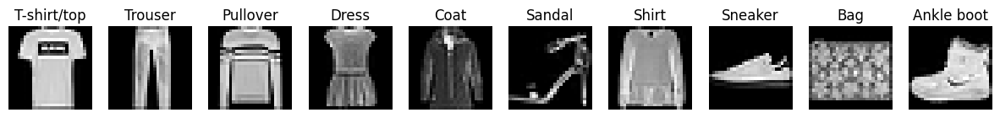

# Fashion-MNIST with PyTorch <!-- omit in toc -->

Train a model using the [Fashion-MNIST dataset](https://github.com/zalandoresearch/fashion-mnist) with PyTorch.


## Table of Contents <!-- omit in toc -->

- [Installation](#installation)
- [Usage](#usage)
- [Development Notes](#development-notes)
- [Experiments](#experiments)

## Installation

1. **Create a Virtual Environment [Optional, but recommended]**

   Run the following command to create a [virtual environment](https://docs.python.org/3/library/venv.html):

   ```bash
   python3 -m venv .venv
   ```

   - **Activate:**

     - **Windows (PowerShell):**

     ```bash
     .venv\Scripts\activate
     ```

     - **Linux/Mac (Bash):**

     ```bash
     source .venv/bin/activate
     ```

   - **Deactivate:**
     ```bash
     deactivate
     ```

2. **Install Dependencies**

   ```bash
   pip install -r requirements.txt
   ```

## Usage

- Help

  Displays the available options and usage details:

  ```bash
  python main.py --help
  ```

- Train the model

  Run training for a specified number of epochs (e.g., 10 epochs):

  ```bash
  python main.py --mode train --num_epochs 10
  ```

- Evaluate the trained model

  ```bash
  python main.py --mode eval
  ```

## Development Notes

- Pre-commit

  We use pre-commit to automate linting of our codebase.

  - Install hooks:
    ```bash
    pre-commit install
    ```
  - Run Hooks manually (optional):
    ```bash
    pre-commit run --all-files
    ```

- Ruff:

  - Lint and format:
    ```bash
    ruff check --fix
    ruff format
    ```

## Experiments

- Understanding impact of learning rate

  ```bash
  ./experiments/lr_experiment.sh
  ```

  

- Understanding impact of network choice (cnn vs fnn)

  ```bash
  ./experiments/cnn_experiment.sh
  ```

  

- Understanding impact of optimizer (adam vs sgd)
  ```bash
  ./experiments/optim_experiment.sh
  ```
  
- Understanding impact of normalization (true vs false)
  ```bash
  ./experiments/disable_norm_experiment.sh
  ```
